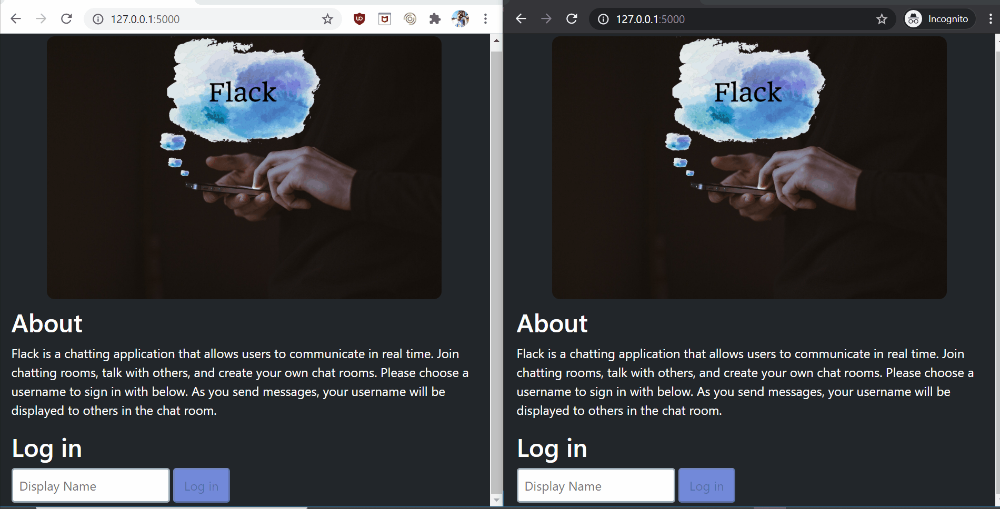

# Flack
An online messaging service where one can send and receive messages in real time.

## Description
Flack allows users to choose a display name, create channels (i.e. chatrooms) to communicate in, as well as see and join existing channels. 

### Protocol and Library Usage
Rather than using the HTTP request/reponse model, the WebSockets protocol allows us to broadcast events to all users. After the inital handshake both the client and the server establish a permanent bidirectional connection. 

The Flask-SocketIO (an extension of Socket.IO) library will upgrade a connection to the WebSockets protocol if possible and otherwise it will use an HTTP polling method. When a user sends a message within Flack, all users that are connected will receive the message thanks to this library.
